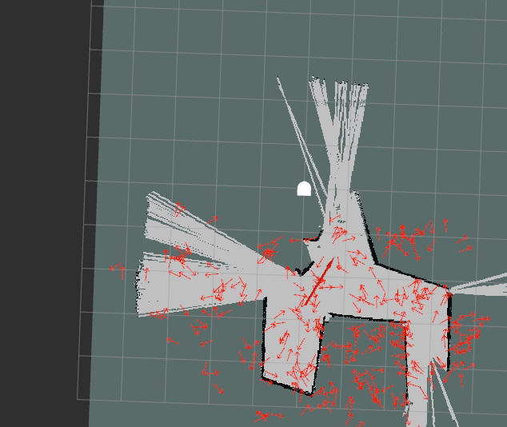

## Robot Localization

### Implementation

For the 2nd mini-project for Introduction to Computational Robotics, we designed a particle filter to solve a robot localization challenge. Given a map, our goal was to locate the robot using lidar, odometery, and preexisting map data. Our final implementation of the particle filter shows clear convergence and with further tuning of variance and particle distribution we belief the partilce filter could be improved.

##### Initialization
The particle filter initializes n particles in a 5x8 meter rectangle around the map given in the bag file (for our deliverable we used n=300). We only perform this completely random distribution step once, and all further particle cloud adjustments are based on the relation of the particles with respect to the bag file data.

##### Calculating Weights
The lidar sensor on the robot collects data about the distances to nearest objects in a full 360 degree range. The filter picks s scan samples to pare down the scan data so as not to slow down the program drastically (for our deliverable we used s=5). This scan data is projected at the position of each particle to estimate the likelihood that a particle is at the robot’s actual location. For each particle, this weight calculation begins with the distance from the scan points to the nearest objects in the map frame. Lower distance values are preferable, and a case where the scan points are all overlapping objects in the map is the best case scenario. Then the distances are converted to actual weight values using a bell curve distribution (e^-d^2.)^3 This bell curve provides a magnified inverse of the distance which is useful because a lower distance should produce a higher weight. The final weight is the normalized sum of the  projected scan weights for each particle.

##### Updating Particles
The weight values are fed into a function that draws random samples from the list of particles. Particles with higher weight values are more likely to be chosen, and the function returns the original n number of particles. This means that many of the resampled particles will likely be overlapping. To account for this, some noise is introduced into the resampled particle cloud. This noise prevents the filter from zeroing in on target too aggressively and allows the particle filter some room for correction. Once the particles are redistributed, the positions are adjusted according to the motion of the actual robot. The direction vector of the robots movement is projected onto each particle, and each particle moves in the appropriate direction and magnitude in it’s own frame of reference.

##### Estimating Robot Pose
The robot pose is estimated by taking the average of all the xy positions and headings in the particle cloud.

### Design Decisons
##### Flexible Particle and Laser Samples
Our particle filter has parameters that allow us to consider how varying number of scan points and particles impacts the behavior of the filter.  This was a helpful tool in debugging to be able to qucikly switch between validating a particle's projected laser scan and how 4 laser scan points taken at even intervals impacted the convergence of the filter.

##### Normal Disribution

After we measure the distance between each point in the projected laser scan and the nearest object on the map, we use a bell curve function to convert that value to a weight. Normal distribution is useful because it converts a small distance value to a large weight. This is magnified further by cubing the result.

##### Modular Code Structure
The particle filter is composed of many small functions that can be validated individually. This approach in our process allowed us to build up the program incrementally and makes the code more readable.

### Challenges
##### Too Much Convergence ?
After distributing and resampling particles, the particles displayed in Rviz seemed to be get downsampled without us implementing that feature.  After confirming that our particle cloud was not changing in size while the filter was being run, we were stumped at what the problem could be. Ultimatley, at that point in our implemntation the particles were aggressivley converging and they were on top of one another.  By introducing random variance to particles during the resample phase, we were able to create a partilce cloud, then a few locations were all teh particles were on top of one another. We had not considered what successfully convergence might look like so we didn't indentify "downsampling" as anything other than a bug in the code.

##### Bag Files
In mini-project 1, we had used bag files as a recording tool and were intailly confused how the bag file could be the basis of the particle filter simulation.  It took us a while to get into a solid workflow and understand the difference between the robot model on the map and traveling red arrow.  It was also intially disorienting to consider how things like the laser_scan topic could be subscribed to without a neato being simulated in Gazebo. This confusion delayed how quickly we were able to start iterating on code.

### Future Improvements
Our filter could be improved by working to tightening the cloud of particles around the proposed robot position. This could be done by increase the weights of particles that have scan values that align with the robots.  Using normal distribution curves with a steeper cutoff would force more convergence.  To help tighten the cloud, we could also decrease the amount of varriance introduced during the resample step so the convergence is more apparent in the mean pose and in visualization.

To determine the coordinates and orientation of the predicted robot location, we are taking the mean of positions and angles for all of the particles within the particle cloud.  To increase the accuracy of the pose prediction, we could use standard deviation to select a value with a low standard deviation that is closer to the mean.

### Lessons Learned
1. This was our first time using a bag file as a starting point for designing an algorithm, and not just as a recording tool, so we had a learning curve at the beginning of the project to understand where the items were coming from that we were seeing in Rviz. By asking questions, we were able to clarify that the large red arrow in Rviz is the robot’s actual position as it was recorded, and the map was also from the bag file.

2. We quickly discovered that visualization is incredibly helpful, especially in Rviz. Our instinct is usually to print out notable values while debugging code, but this is less useful when working with hundreds of particle objects. We created markers that scale according to the weight of each particle and used these to better understand the behavior of our algorithm during the development stage. This occasionally led to some uncomfortable to look at visualizations.

