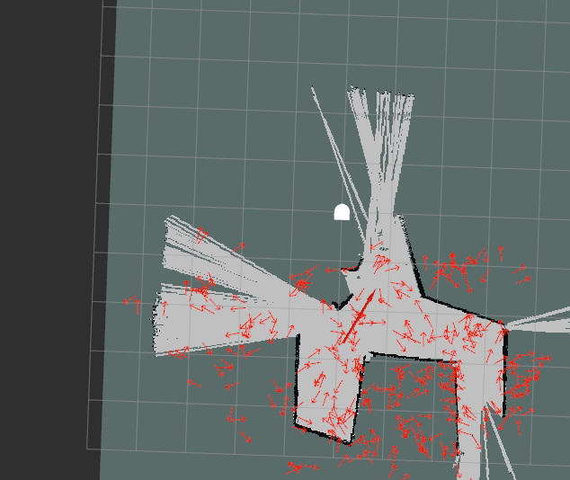

## Robot Localization

### Project Goal

The goal of this project was to develop a particle filter algorithm for the purpose of robot localization.

### Implementation

### Design Decisons

Our particle filter has some adjustable parameters, like the number of particles and the number of laser scan points used. We decided it would be useful to be able to adjust these parameters for debugging purposes, and it's also nice to have some flexibility when using the filter in general.

After we measure the distance between each point in the projected laser scan and the nearest object on the map, we use a bell curve function to convert that value to a weight.

### Challenges

### Improvements

### Lessons Learned

##### Implmentation Plan

We are planning on using pf_scaffolded.py for the project.

1) Neato is a location

2) Evenly distibute particle across the map

3) Using neato scan data, assign a weight to each particle

4) Using the weigts, resample particles so that particles are concentrating in highlt weighted portions of the map

5) Neato moved to a new location

Step 3-5 repeats to track the estimated locilization of the neato.

